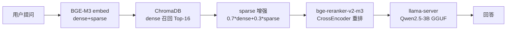

# 企业内部知识库 — 项目进度

> 最后更新：2026-05-26 17:30 | 版本：v0.6 (dense+sparse+reranker)

---

## 一、项目概况

| 项目 | 值 |
|------|-----|
| 路径 | `C:\Users\14120\enterprise-kb-agent\` |
| 定位 | 基于 RAG 的离线企业知识库问答系统 |
| Python | `D:\Anaconda3\python.exe`（必须用这个） |

---

## 二、技术架构



### 模型清单

| 模型 | 路径 | 大小 | 用途 |
|------|------|------|------|
| bge-m3 | `D:\bge-m3` | 4.3GB | 文本嵌入 dense+sparse（CPU） |
| bge-reranker-v2-m3 | `D:\bge-reranker-v2-m3` | 4.3GB | CrossEncoder 重排序（CPU） |
| Qwen2.5-3B GGUF | `D:\Qwen2.5-3B-Instruct-GGUF\` | 1.96GB | 生成推理（CPU） |
| Qwen2.5-3B 原始 | `D:\Qwen2.5-3B-Instruct\` | 5.7GB | 已废弃（旧 transformers 用） |

### llama.cpp

| 项目 | 值 |
|------|-----|
| 版本 | b9330 |
| 路径 | `D:\llama-b9330\llama-b9330-bin-win-cpu-x64\` |
| 类型 | 纯 CPU 版 |
| 服务地址 | `http://127.0.0.1:8080` |

---

## 三、服务启动命令

```bash
# 1. 启动推理服务（必须先启）
D:/llama-b9330/llama-b9330-bin-win-cpu-x64/llama-server.exe \
  -m D:/Qwen2.5-3B-Instruct-GGUF/qwen2.5-3b-instruct-q4_k_m.gguf \
  --host 127.0.0.1 --port 8080 -c 4096

# 2. 启动 RAG 后端
D:/Anaconda3/python.exe -m uvicorn backend.main:app --host 0.0.0.0 --port 8000
# 或: cd C:\Users\14120\enterprise-kb-agent && D:/Anaconda3/python.exe -m uvicorn backend.main:app --host 0.0.0.0 --port 8000

# 3. 启动 Web UI
D:/Anaconda3/python.exe frontend/app.py

# 4. 重建索引
D:/Anaconda3/python.exe scripts/ingest.py rebuild
```

---

## 四、知识库内容（8 份 / 65 chunks）

| 文件 | chunks | 领域 |
|------|--------|------|
| GBT44261.1-2024国家标准正式发布.md | 4 | 生物特征+视频监控 |
| GBT44261系列标准解读.md | 6 | 生物特征+视频监控 |
| 生物特征识别视频监控合规文件清单.md | 15 | PIPL/DSL/等保法规 |
| SAC-TC28-SC41生物特征识别分技术委员会.md | 6 | 标准化机构 |
| SACTC28SC41名称和工作范围调整.md | 2 | 标准化机构 |
| GPU显卡行业规范查找路径.md | 14 | GPU 行业 |
| 车间报警手册-GPU电子制造安全生产.md | 15 | 安全生产 |
| README.md | 3 | 项目说明 |

---

## 五、性能基准

| 指标 | 旧版 (transformers) | 新版 (llama.cpp) |
|------|---------------------|-------------------|
| 推理速度 | 1.4 tok/s | 5.9 tok/s |
| 端到端耗时 | 173s | **20-64s** |
| 模型体积 | 6GB (fp16) | 2GB (q4_k_m) |
| 内存占用 | 6GB | ~2GB |

---

## 六、已修复问题

| # | 问题 | 修复 |
|---|------|------|
| 1 | C 盘空间不足 | 清 npm/Docker，模型放 D 盘 |
| 2 | Ollama 下载失败 | 换 ModelScope 直接 git clone |
| 3 | 架构从 Ollama 改为本地加载 | transformers 直接加载 |
| 4 | Python 版本错误 | 强制用 `D:\Anaconda3\python.exe` |
| 5 | 端口占用 | 启动前 `taskkill` 清端口 |
| 6 | 模型慢 | 降 max_tokens 到 128 |
| 7 | 小模型幻觉 | repetition_penalty + 截断正则 |
| 8 | 回答自相矛盾 | 去掉"没找到就说"指令 |
| 9 | Gradio 6.0 不兼容 | 已适配 |
| 10 | API 超时 | 降 tokens + 加前端 timeout |
| 11 | ChromaDB l2 距离算错 | → cosine + 阈值 0.20 |
| 14 | 端到端 173s | → llama.cpp 20-32s |

---

## 七、待修复问题

| # | 问题 | 建议 |
|---|------|------|
| 12 | LLM Rerank 内存溢出 | ✅ 换 bge-reranker-v2-m3 CrossEncoder |
| 13 | 回答截断 (128 tokens) | 提升到 200-256 |
| 15 | 无 Cross-Encoder 重排序 | ✅ v0.6 Dense+Sparse+Reranker 管线 |
| 16 | 无 sparse 检索增强 | ✅ v0.6 BGE-M3 dual-vector 融合 |
| — | 单线程无并发 | 加请求队列 |
| — | 需要手动启动三服务 | 写启动脚本 / docker-compose |
| — | CPU 推理慢 | 有 GPU 后换 CUDA 版 llama.cpp |

---

## 八、关键文件修改记录

| 文件 | 改动 |
|------|------|
| `backend/rag/embedder.py` | v0.6: BGE-M3 返回 {dense, sparse} 双向量 |
| `backend/rag/vector_store.py` | v0.6: 新增 search_sparse() + sparse_index |
| `backend/rag/retriever.py` | v0.6: Dense+Sparse 融合 + CrossEncoder Rerank |
| `backend/config.py` | 新增 `LLM_GGUF_PATH` + `RERANKER_MODEL_PATH`，阈值 0.20 |
| `backend/rag/generator.py` | 重写：transformers → llama-server HTTP API |
| `docs/UPGRADE_ISSUES.md` | v0.5→v0.6 升级踩坑全记录 (8 个问题 + 教训) |
